## Description
This project is a REST Bookstore API built with Spring Boot. 
It allows clients to preform CRUD operations on books and supports 
advanced features such as filtering, sorting, and pagination. 
To test I utilized Postman application. 

## Technologies used
- Java
- Spring Boot
- RESTful APIs (HTTP)
- JSON
- Maven
- Intellij IDEA 2025
- Postman

# Get all Books
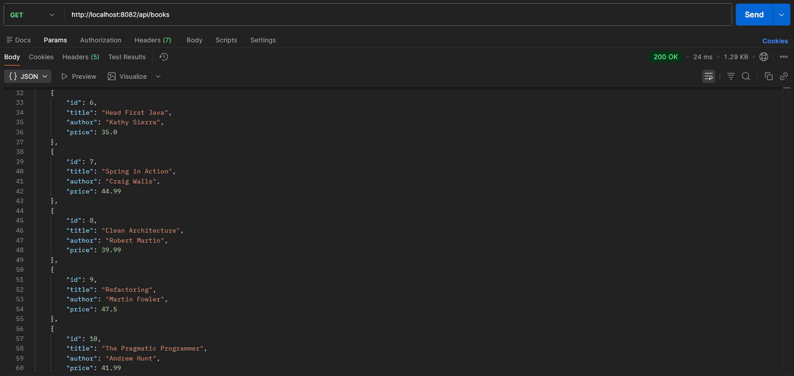
http: GET /api/books

# GET Book by ID
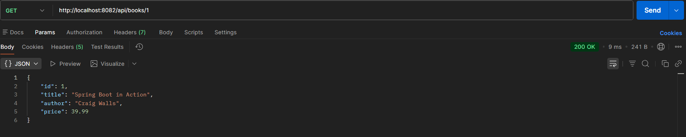
http: GET /api/books/{ID}

# POST Create Book
http: POST /api/books
body:   {
        "title": "Post Book title",
        "author": "Daniel",
        "price": "25.99"
        }

# Search by title
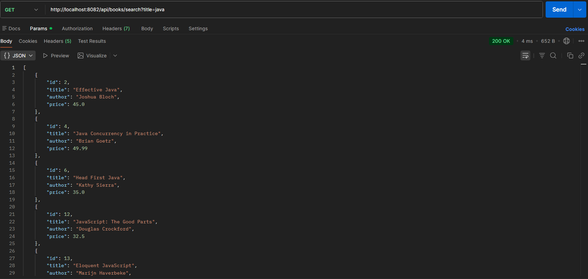
http: GET /api/books/search?title=java

# Price Filter
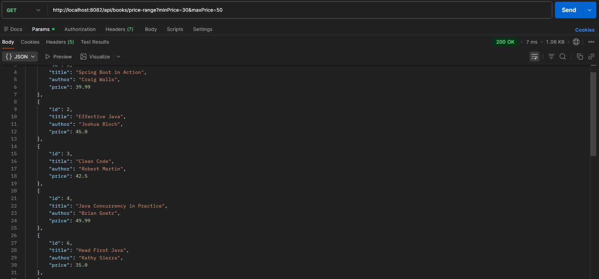
http: GET /api/books/price-range?minPrice=30&maxPrice=50

# Sort Books
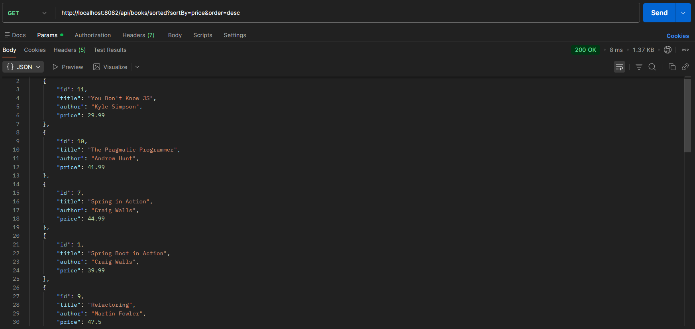
http: GET /api/books/sorted?sortBy=price&order=desc

# PUT Full Update 
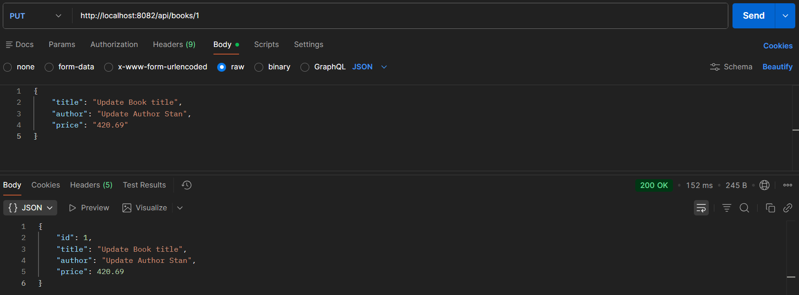
http: PUT .../api/books/{ID}
body:   {
        "title": "Update Book title",
        "author": "Update Author Stan",
        "price": "420.69"
        }

# PATCH Partial Update
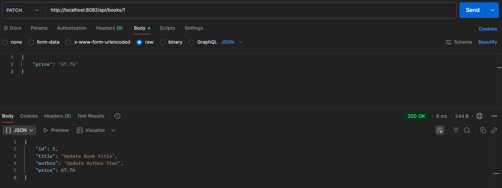
http: PATCH .../api/books/{ID}
body:   {
        "price": "67.76"
        }

# DELETE Book 
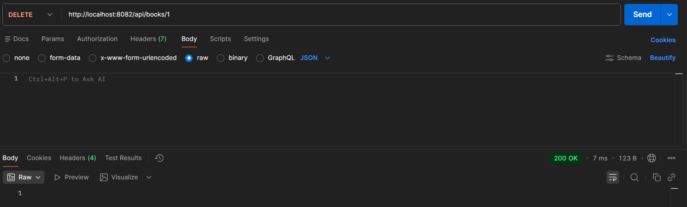
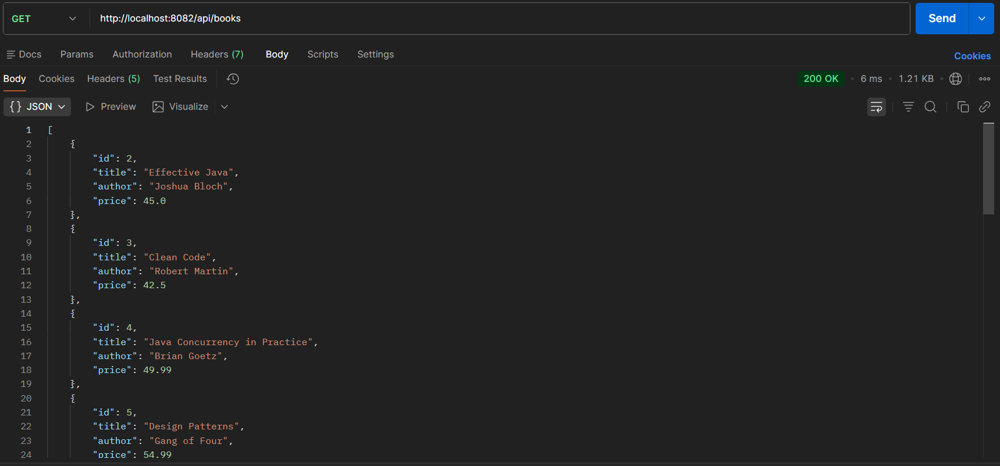
http: DELETE .../api/books/search?title=java

# Pageination 
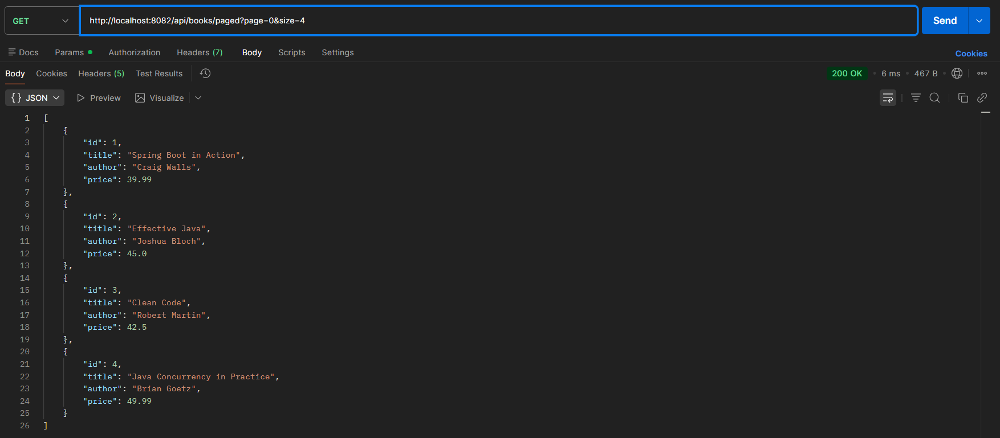
GET .../api/books/paged?page=0&size=4

# Advenced
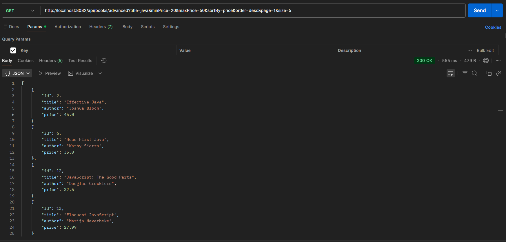
GET .../api/books/advanced?title=java&minPrice=20&maxPrice=50&sortBy=price&order=desc&page=1&size=5
